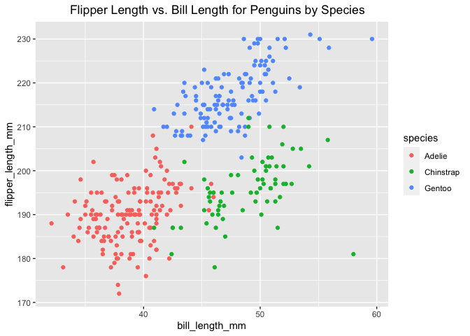

P8105\_hw1\_hc3212
================
HeningCui
2021/9/26

This is the solution for Homework 1.

## Problem 1

Create a data frame comprised of:

  - a random sample of size 10 from a standard Normal distribution
  - a logical vector indicating whether elements of the sample are
    greater than 0
  - a character vector of length 10
  - a factor vector of length 10, with 3 different factor “levels”

Solution:

Create the sample:

``` r
library(tidyverse) 
```

    ## ── Attaching packages ─────────────────────────────────────── tidyverse 1.3.1 ──

    ## ✓ ggplot2 3.3.5     ✓ purrr   0.3.4
    ## ✓ tibble  3.1.4     ✓ dplyr   1.0.7
    ## ✓ tidyr   1.1.3     ✓ stringr 1.4.0
    ## ✓ readr   2.0.1     ✓ forcats 0.5.1

    ## ── Conflicts ────────────────────────────────────────── tidyverse_conflicts() ──
    ## x dplyr::filter() masks stats::filter()
    ## x dplyr::lag()    masks stats::lag()

``` r
set.seed(1)
prob1_df =
  tibble(
    sample_1 = rnorm(10),
    samp_vec_0 = sample_1 > 0,
    char_vec = c("a", "b", "c", "d", "e", "f", "g","h", "i", "j"),
    fact_vec = factor(c("low", "high", "low", "high", "low", "high", "low", "mid", "mid", "low"))
  )
```

Taking the mean of each variable.

    ## [1] 0.1322028

    ## [1] 0.6

    ## Warning in mean.default(pull(prob1_df, char_vec)): argument is not numeric or
    ## logical: returning NA

    ## [1] NA

    ## Warning in mean.default(pull(prob1_df, fact_vec)): argument is not numeric or
    ## logical: returning NA

    ## [1] NA

The number and logical vector could take mean while the character and
factor vector could not.

Convert the logical, character, and factor variable into numeric.

``` r
as.numeric(pull(prob1_df, samp_vec_0))
as.numeric(pull(prob1_df, char_vec))
```

    ## Warning: NAs introduced by coercion

``` r
as.numeric(pull(prob1_df, fact_vec))
```

Calculate the mean again after convert.

    ## [1] 0.6

    ## Warning in mean(as.numeric(pull(prob1_df, char_vec))): NAs introduced by
    ## coercion

    ## [1] NA

    ## [1] 1.9

After covert, the factor and logical variable could turn into numeric
while the character variable could not. The logical variable with “TRUE”
and “FALSE” result could turn into “1” and “0”, then the mean could be
calculated. the facter variable could turn into “1”, “2”, “3”, and
calculated mean. Character variable will all equal to NA, the mean will
return as NA.

## Problem 2

The trunk below is to download the a package containing the penguins
dataset:

``` r
data("penguins", package = "palmerpenguins")
```

The **Penguins** dataset contains the following variables:
bill\_depth\_mm, bill\_length\_mm, body\_mass\_g, flipper\_length\_mm,
island, sex, species, year.

Bill depth (mm) is a numeric variable. The mean of bill depth (mm) is
17.1511696. Values for bill depth range from 13.1, 21.5 (min, max).

Bill length (mm) is a numeric variable. The mean of bill length (mm) is
43.9219298. Values for bill length range from 32.1, 59.6 (min, max).

Body mass (g) is a integer variable. The mean of Body mass (g) is
4201.754386. Values for bill depth range from 2700, 6300 (min, max).

Flipper length (mm) is a integer variable. The mean of flipper length
(mm) is 200.9152047. Values for flipper length range from 172, 231 (min,
max).

Island is a factor variable, which has Biscoe, Dream, Torgersen islands.

Sex is a factor variable, which has female, male categories.

Species is a factor variable, which has species Adelie, Chinstrap,
Gentoo.

Year is a integer variable. The range for the years variable is from
2007, 2009.

The number of rows (observations) in the Penguin dataset is 344.

The number of columns (variables) in the Penguin dataset is 8.

This chunk is to generate a scatter plot for bill length and flipper
length, each color represents a different species.

``` r
library(ggplot2)
set.seed(1)
ggplot(penguins, aes(x = bill_length_mm, y = flipper_length_mm, color = species)) + geom_point() + ggtitle("Flipper Length vs. Bill Length for Penguins by Species") + theme(plot.title = element_text(hjust = 0.6))
```

    ## Warning: Removed 2 rows containing missing values (geom_point).

<!-- -->

``` r
ggsave("scatterplot_penguin.pdf")
```

    ## Saving 7 x 5 in image

    ## Warning: Removed 2 rows containing missing values (geom_point).
